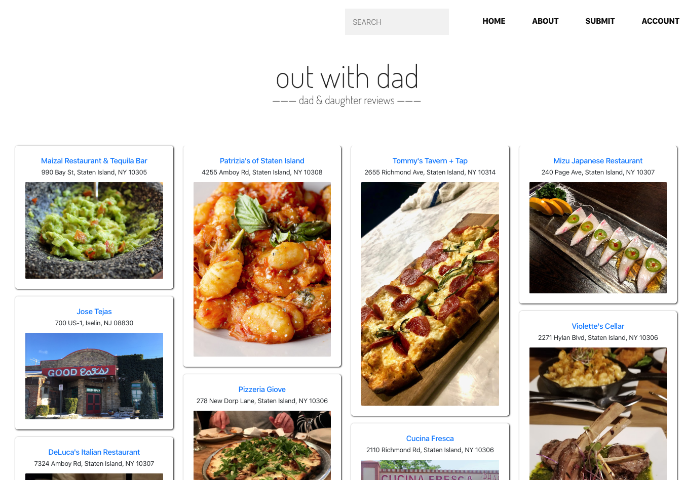

# Intensive Project
Build an MVP

## Concept
I usually have dinner with my Dad once a week. Because of this we've been to A LOT of restaurants back in Staten Island, where I'm from. I've always had this idea that he & I should start a blog of sorts where we review all of the places we've been to. Here is what I came up with..

## Preview
In progress..

## Outline
A restaurant review platform that allows users to leave comments on an already existing review (by my Dad & I). If a restaurant is not present on the site, users can submit it.
Technologies: Python, Flask, MongoDB, HTML, CSS, & Bootstrap

## Demo
